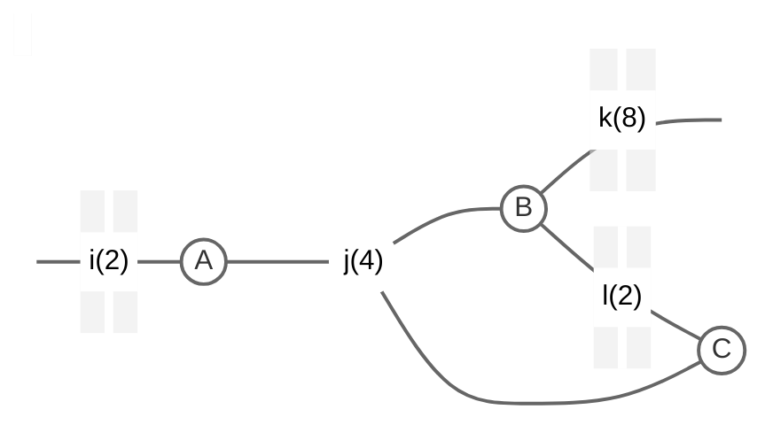
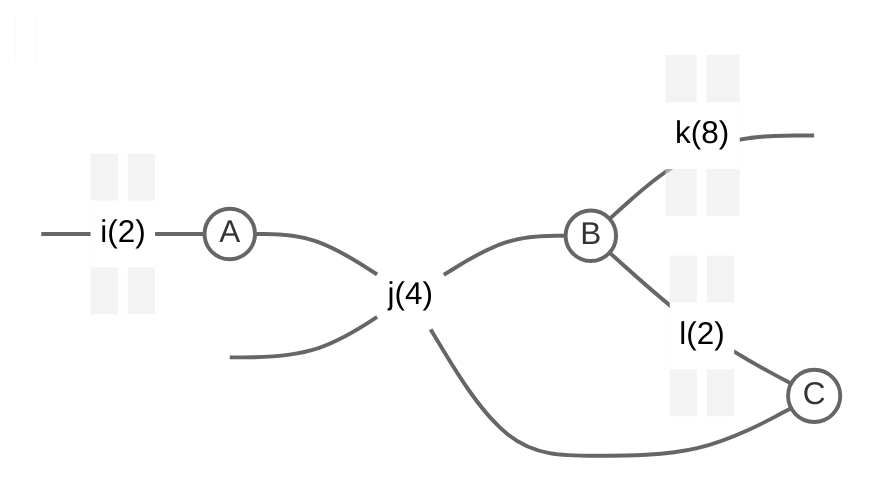

# Einsum Benchmark Dataset Metadata Documentation

This document provides detailed descriptions for each column in the `metadata.csv` (and `metadata.xlsx`) file, which contains metadata about every instance in the benchmark dataset.

- [Einsum Benchmark Dataset Metadata Documentation](#einsum-benchmark-dataset-metadata-documentation)
  - [Metadata column descriptions](#metadata-column-descriptions)
    - [General tensor network metadata](#general-tensor-network-metadata)
      - [`filename`](#filename)
      - [`tensors`](#tensors)
      - [`different_indices`](#different_indices)
      - [`hadamard_products`](#hadamard_products)
      - [`edges`](#edges)
      - [`hyperedges`](#hyperedges)
      - [`tensors_in_largest_hyperedge`](#tensors_in_largest_hyperedge)
      - [`tensors_with_traces_or_diagonals`](#tensors_with_traces_or_diagonals)
      - [`independent_components`](#independent_components)
      - [`tensors_in_largest_component`](#tensors_in_largest_component)
      - [`smallest_dimension_size`](#smallest_dimension_size)
      - [`largest_dimension_size`](#largest_dimension_size)
      - [`log2_output_size`](#log2_output_size)
      - [`file_size_in_mb`](#file_size_in_mb)
      - [`dtype`](#dtype)
    - [Metadata about the path optimized for minimal flops](#metadata-about-the-path-optimized-for-minimal-flops)
      - [`opt_flops_path_size_log2`](#opt_flops_path_size_log2)
      - [`opt_flops_path_flops_log10`](#opt_flops_path_flops_log10)
      - [`opt_flops_min_density`](#opt_flops_min_density)
      - [`opt_flops_avg_density`](#opt_flops_avg_density)
    - [Metadata about the path optimized for a small largest intermediate](#metadata-about-the-path-optimized-for-a-small-largest-intermediate)
      - [`opt_size_path_size_log2`](#opt_size_path_size_log2)
      - [`opt_size_path_flops_log10`](#opt_size_path_flops_log10)
      - [`opt_size_min_density`](#opt_size_min_density)
      - [`opt_size_avg_density`](#opt_size_avg_density)
    - [Result metadata](#result-metadata)
      - [`sum_output`](#sum_output)
  - [Example instances](#example-instances)

## Metadata column descriptions

We will use `ij,jkl,jl->ik` with tensors A, B, and C as running example throughout the description, the corresponding graph is shown below. The size of an index is shown shown in parenthesis. 

### General tensor network metadata

#### `filename`

**The unique identifier or name of the tensor network instance.**

If you work with the raw data you need to append `.p` as extension for the pickle files.

#### `tensors`

**The total number of tensors in the tensor network.**

Our example instance has 3 tensors.

#### `different_indices`

**The number of unique indices  across all tensors in the network.**

Our example has the 4 unique indices i,j,k, and l.

#### `hadamard_products`

**The number of Hadamard products in the tensor network.**

An example format string containing a Hadamard product would be `ij,ij,jkl->il`, because there are two tensors with the indices i and j.

Hadamard products can be calculated right a way and thus decrease the number of relevant tensors for path computations or any arithmetical evaluation of the tensor network. However many implementations do not take advantage of this fact.

 
#### `edges`

**The number of contraction edges in the tensor network.**

An index is a contraction edge if it is connected to at least two tensors and is not part of the output. In our example there are the edges j and l.

Indices that are only connected to a single tensor can be optimized away and only lead to a unitary operation, whereas an edge always leads to operations between at least two tensors.
Moreover, indices that are part of the output are often visualized as an open edge not connected to anything, they need to be treated differently and also contain some optimization potential.

#### `hyperedges`

**The number of contraction hyperedges.**

Like edges these are indices, that are not part of the output, but in this case they need to be connected to more than two tensors. In our example there is only the hyperedge j.

The number of hyperedges is important since many algorithms do not support them.

#### `tensors_in_largest_hyperedge`

**The number of tensors involved in the largest hyperedge of the network.**

In our example all three tensors are in the largest hyperedge j.

We report this number because large hyperedges can be challenging for contraction path finding algorithms.

#### `tensors_with_traces_or_diagonals`

**The count of tensors that have traces or diagonals.**

For example `ii,ij->j` contains the diagonal of the first matrix. But one may also need traces like `ii->i` or diagonal broadcasting like `i->ii`.

Some einsum implementations do not support diagonals or traces, so they can only execute instances with a zero in this column.

#### `independent_components`

**The number of independent components in the tensor network.**

Independent components can be treated separately, which has a high potential for optimization and parallelization. In each component all nodes are connected by a path via edges. We only consider edges, i.e. indices not part of the output, when searching for independent components. Therefore, tensors that are only connected via indices that are part of the output are considered independent.

If we adjust the example graph to make j and output index as well, we get two independent components, one containing only A and one containing B and C.

#### `tensors_in_largest_component`

**The number of tensors in the largest independent component of the network.**

As independent components can be treated separately the real complexity of a tensor network is defined by its largest component. Some instances in the dataset have many smaller components and thus are much easier to compute than the number of all tensors would suggest.

#### `smallest_dimension_size`

**The size of the smallest dimension (i.e. length of the smallest index / axis) across all tensors.**

In our example smallest dimension size is 2.

A large smallest index indicates that the individual tensors may also be large.
Many problems have the same size for all dimensions. This becomes apparent when looking at the largest dimension size as well.

#### `largest_dimension_size`

**The size of the largest dimension (i.e. length of the largest index / axis) across all tensors.**

In our example the largest dimension size is 8.

A small largest dimension size indicates that the tensors in the network are rather small.
Many problems have the same size for all dimensions. This becomes apparent when looking at the smallest dimension size as well. Moreover, some instances have dimensions with size 1 which may be interesting for optimizations.

#### `log2_output_size`

**The logarithm base 2 of the output tensor size.**

As the result of our example is a $2 \times 8$ matrix with the indices i and k, the log2 size of the output is 4.

May be important to understand if the output fits into the memory. A output size of zero means that the result is a scalar.

#### `file_size_in_mb`

**The size of the tensor network instance file in megabytes.**

Indicates the memory requirement for loading this instance.

#### `dtype`

**The data type of the tensors (float64, complex128, etc.).**

May be important, because not all platforms or software packages support all data types. Using the provided paths should result in a correct result under the data type size constraints.

### Metadata about the path optimized for minimal flops

The following columns all refer to the path we found while minimizing the total number of operations. 

#### `opt_flops_path_size_log2`

**The binary logarithm of the size of the largest intermediate tensor during the contraction of the tensor network.**

Indicates the minimal required memory during the contraction of the tensor network.

#### `opt_flops_path_flops_log10`

**The logarithm base 10 of the total FLOPs.**

As shown in the paper this may only be a very rough proxy for the contraction time of this instance.

#### `opt_flops_min_density`

**The density of the sparsest intermediate tensor during the contraction.**

A low density indicates that there is at least one sparse intermediate during the contraction, it shows that some instances become extremely sparse. However, sometimes only smaller tensors are sparse, while larger ones are not, therefore we also report the average density (see next column).

#### `opt_flops_avg_density`

**Average density over all intermediate tensors.** 

We sum up all non zero entries in all intermediates and divide the total by the sum of all entries, including zeroes. A low average density indicates a large performance benefit for a sparse einsum backend.

### Metadata about the path optimized for a small largest intermediate
The following columns all refer to the path we found while minimizing the size of the largest intermediate tensor. Apart from being for a different path these columns and their descriptions are the same as for the path optimized for FLOPs.

#### `opt_size_path_size_log2`

**The binary logarithm of the size of the largest intermediate tensor during the contraction of the tensor network.**

Indicates the minimal required memory during the contraction of the tensor network.

#### `opt_size_path_flops_log10`

**The logarithm base 10 of the total FLOPs.**

As shown in the paper this may only be a very rough proxy for the contraction time of this instance.

#### `opt_size_min_density`

**Density of the sparsest intermediate tensor during the contraction.**

A low density indicates that there is at least one sparse intermediate during the contraction, it shows that some instances become extremely sparse. However, sometimes only smaller tensors are sparse, while larger ones are not, therefore we also report the average density (see next column).

#### `opt_size_avg_density`

**Average density over all intermediate tensors.** 

We sum up all non zero entries in all intermediates and divide the total by the sum of all entries, including zeroes. A low average density indicates a large performance benefit for a sparse einsum backend.

### Result metadata

#### `sum_output`

The sum of all elements in the output tensor, which may be a complex number.

Can be used to validate the correctness of an einsum implementation.

## Example instances

We discuss some example instances from the benchmark data set [here](./examples/metadata.ipynb).